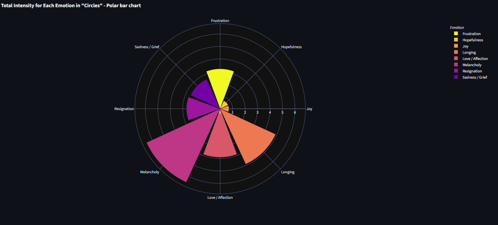
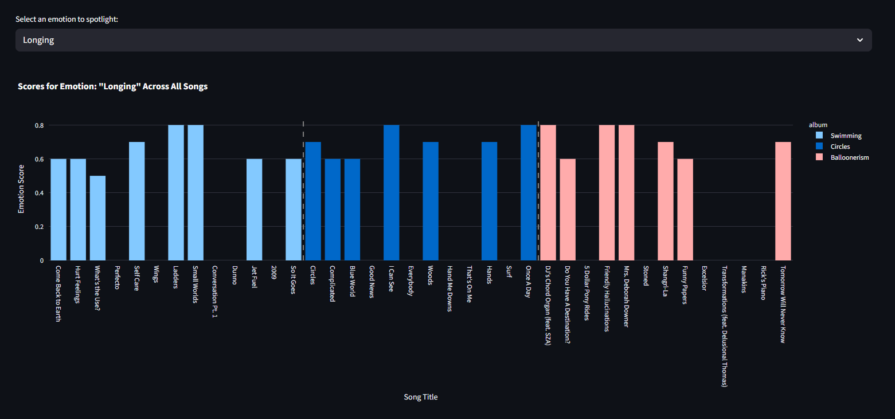
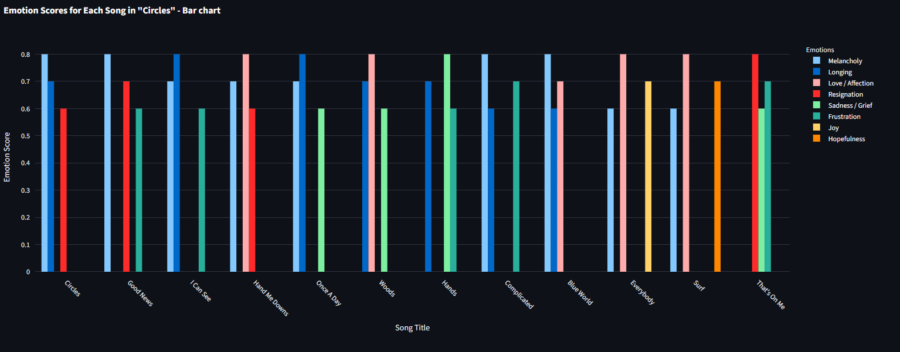

# Mac Miller Music Emotion Analysis 🎵

A personal exploration into the emotional landscape of Mac Miller’s albums. This project dives deep into his lyrics to uncover what he might have been feeling during different phases of his life, highlighting the underlying emotions in his songs across three albums: *Balloonerism*, *Swimming*, and *Circles*.

---

## 🌟 Project Overview

Mac Miller has always been one of my favorite artists. His music is honest, raw, and metaphorical. Even if you don’t fully relate to the lyrics, he has this unique ability to **make you feel** his music.

I’ve always been fascinated by how his emotions evolved across different albums. This project analyzes his lyrics to visualize the emotions he expressed, giving insight into his mindset during the years he made these albums:

* **Balloonerism (2014)** – Peak of addiction, heavy substance use, rising fame but feeling depressed.
* **Swimming (2016)** – Attempting sobriety, processing struggles, learning to "swim" through depression.
* **Circles (2018)** – Acceptance of struggles, softer, more resigned emotions.

The analysis uses **Gemini 1.5 Flash LLM** to extract dominant emotions, **pandas** for cleaning and reshaping the data, and **Plotly** for creating interactive charts throughout the **Streamlit dashboard**.

---

## 🛠 Project Structure

```
MM-Analysis/
├── dashboard/
│   ├── dashboard.py          # Streamlit dashboard with Plotly charts
│   ├── Analysed_data.csv # Processed emotion data
│   └── requirements.txt      # Dashboard dependencies
│
├── Data-collection-and-analysis/
│   ├── main.py               # Scripts to pull lyrics from APIs
│   ├── mac_miller_album_analysis.ipynb # Analysis notebook
│   ├── balloonerism.jsonl
│   ├── circles.jsonl
│   └── swimming.jsonl
│
├── .env                     # API keys (Spotify, Genius, Gemini) [NOT in GitHub]
└── README.md
```

---

## ⚡ Features

* **Gemini LLM Analysis:** Used Gemini 1.5 Flash model to detect the top 3 dominant emotions in each song.
* **Interactive Dashboard:** Built with Streamlit + Plotly to explore emotion scores per song and album.
* **Emotion Visualizations:** Bar charts, heatmaps, and pie charts showing the emotional intensity of songs.
* **Song-Level Analysis:** Dive into individual tracks and see which emotions dominate.

---

## 📊 Dashboard Preview

* **Bar Chart:** Scores of different emotions per song in an album.
* **Heatmap:** Emotional intensity across all songs.
* **Pie Chart:** Overall emotional composition of the album.

> Example:



---

## ⚙️ Installation & Setup

1. **Clone the repo**

```bash
git clone https://github.com/<your-username>/MM-Analysis.git
cd MM-Analysis
```

2. **Create virtual environment**

```bash
python -m venv venv
source venv/bin/activate  # macOS/Linux
venv\Scripts\activate     # Windows
```

3. **Install dependencies**

```bash
pip install -r dashboard/requirements.txt
pip install -r data_collection_and_analysis/requirements.txt
```

4. **Set up API keys**

* Create a `.env` file at project root:

```
SPOTIFY_CLIENT_ID=your_spotify_client_id
SPOTIFY_CLIENT_SECRET=your_spotify_client_secret
GENIUS_API_KEY=your_genius_api_key
GEMINI_API_KEY=your_gemini_api_key
```

---

## 🚀 Run the Dashboard

```bash
streamlit run Streamlit-dashboard/dashboard.py
```

* Choose an album from the sidebar to explore emotions per song.
* View bar charts, heatmaps, and pie charts of emotional intensity.

---

## 💡 Insights

* **Balloonerism:** Fear, anxiety, and nostalgia dominate. Reflects peak addiction and depressive states.
* **Swimming:** More complex emotions like melancholy, frustration, and a hint of self-love as Mac fights depression.
* **Circles:** Acceptance and resignation, softer and reflective emotions dominate.

---

## 📌 Notes

* This is a **personal analysis** and reflects interpretation based on **Gemini 1.5 Flash LLM** output.

## ✨ Acknowledgements

* [Mac Miller](https://en.wikipedia.org/wiki/Mac_Miller) – for his incredible music and honesty.
* [Genius API](https://genius.com/developers) – for lyrics.
* [Gemini LLM](https://developers.generativeai.google) – for emotion analysis.
* [Streamlit](https://streamlit.io/) + [Plotly](https://plotly.com/) – for interactive dashboards.


